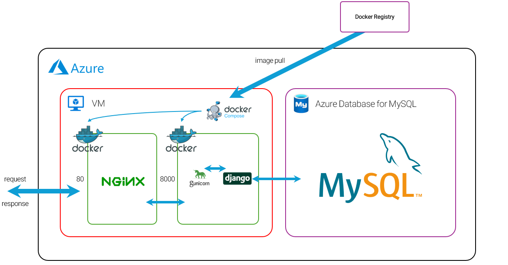

# ✨ N.M. 백엔드 서버

서비스를 위한 RestAPI를 제공하며, Swagger를 통해 API 문서화 및 효율적인 협업을 지원합니다.

## 🏗️ 시스템 구성도



## 🛠️ 기술 스택

### 🔹 백엔드
<p>
  
  
  
  
</p>


### 🔹 데이터베이스
<p>
  
</p>

### 🔹 배포 & 인프라
<p>
  
  
</p>


## 📌 주요 기능

### 🔹 회원 관리 기능

### 🔹 식단 관리 기능

### 🔹 그룹 관리 기능

### 🔹 물품 관리 기능

## 📥 설치 및 실행 방법

### 🔹 공통

**환경 변수 설정**
```
# Django
SECRET_KEY = 'your_django_secret_key'
DJANGO_ENV = 'development'

# Database
DB_NAME = 'your_db_name'
DB_USER = 'your_db_user'
DB_PASSWORD = 'your_db_password'
DB_HOST = 'your_db_host'
DB_PORT = 'your_db_port'
```

### 🔹 일반 설치

**가상 환경 설정**  
> 자세한 내용은 [Python 가상 환경 공식 문서](https://docs.python.org/ko/3.9/library/venv.html) 참조
```bash
$ python -m venv venv
$ venv/script/activate
```

**필요한 패키지 설치** 
```bash
$ pip install -r requirements.txt
```
**마이그레이션**
```bash
$ python manage.py makimigrations
$ python manage.py migrate
```
**서버 실행**
```bash
$ python manage.py runserver
```

### 🔹 Docker
**Docker Compose 실행**
```bash
$ docker-compose up --build
```

## 🔹 문서
- [API 문서](./assets/docs/Application_API_Docs.pdf)
- [DB 설계 문서](./assets/docs/DB_Design.pdf)
