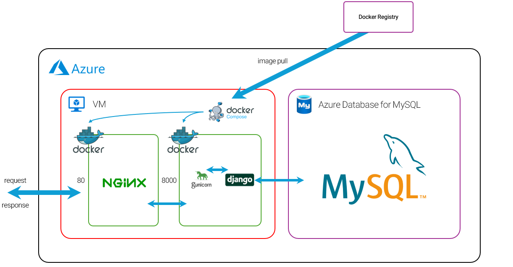

# ✨ N.M. 백엔드 서버

서비스를 위한 RestAPI를 제공하며, Swagger를 통해 API 문서화 및 효율적인 협업을 지원합니다.

## 🏗️ 시스템 구성도



## 🛠️ 기술 스택

### 🔹 백엔드
<p align="center">
  
  
  
</p>

- **Python**: 웹 애플리케이션 개발을 위한 주요 프로그래밍 언어
- **Django**: 빠르고 효율적인 웹 개발을 위한 Python 웹 프레임워크
- **Gunicorn**: Python WSGI 서버로, Nginx로부터 전달받은 요청을 Django 애플리케이션에 전달하여 실행
- **Nginx**: 클라이언트 요청을 분배하고, 리버스 프록시 역할을 하는 웹 서버

### 🔹 데이터베이스
<p align="center">
  
</p>

- **MySQL**: 관계형 데이터베이스 관리 시스템 (RDBMS)으로, 데이터 저장 및 관리

### 🔹 배포 & 인프라
<p align="center">
  
</p>

- **Docker**: 애플리케이션을 컨테이너화하여 환경에 구애받지 않고 일관된 실행을 보장
- **Azure**: 클라우드 플랫폼을 사용한 애플리케이션 배포 및 관리

## 📌 주요 기능

### 🔹 회원 관리 기능

### 🔹 식단 관리 기능

### 🔹 그룹 관리 기능

### 🔹 물품 관리 기능

## 📥 설치 및 실행 방법

### 🔹 공통

**환경 변수 설정**
```
# Django
SECRET_KEY = 'your_django_secret_key'
DJANGO_ENV = 'development'

# Database
DB_NAME = 'your_db_name'
DB_USER = 'your_db_user'
DB_PASSWORD = 'your_db_password'
DB_HOST = 'your_db_host'
DB_PORT = 'your_db_port'
```

### 🔹 일반 설치

**가상 환경 설정**  
> 자세한 내용은 [Python 가상 환경 공식 문서](https://docs.python.org/ko/3.9/library/venv.html) 참조
```bash
$ python -m venv venv
$ venv/script/activate
```

**필요한 패키지 설치** 
```bash
$ pip install -r requirements.txt
```
**마이그레이션**
```bash
$ python manage.py makimigrations
$ python manage.py migrate
```
**서버 실행**
```bash
$ python manage.py runserver
```

### 🔹 Docker
**Docker Compose 실행**
```bash
$ docker-compose up --build
```

### 🔹 추가 설정
